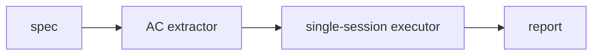

# opslane-verify

A verification layer for Claude Code. Reads your spec, runs a browser agent against your local dev server for each acceptance criterion, and returns pass/fail with screenshots — before you push. No CI. No infrastructure.




## Install

Requires Claude Code with OAuth login (`claude login`).

**Plugin marketplace:**
```bash
/plugin marketplace add opslane/verify
/plugin install opslane-verify@opslane/verify
```

**Manual (contributors):**
```bash
git clone https://github.com/opslane/verify.git
cd verify/pipeline && npm install
```

> Manual clone gives you the pipeline CLI but not the `/verify` slash commands. See [CLAUDE.md](./CLAUDE.md) for contributor setup.

## Usage

```bash
# One-time setup — installs browser, discovers login steps, indexes your app
/verify-setup

# Run verification against a spec
/verify
```

`/verify` asks for your spec, reviews it for ambiguities, then runs the pipeline. Results appear inline with a link to the full HTML report.

## Debugging failures

After a run, evidence lives in `.verify/runs/<run_id>/`:

```bash
# Open the HTML report (screenshots, verdicts, and steps in one page)
open .verify/runs/*/report.html

# Browse raw evidence for a specific AC
ls .verify/runs/*/evidence/<ac_id>/
```

Each AC's evidence directory contains:
- `result.json` — verdict, confidence, reasoning, steps taken
- `*.png` — screenshots captured during execution

## Architecture

The pipeline runs two stages, then generates a report:

**1. AC Extractor** — an LLM call (no tools) that parses the spec into grouped acceptance criteria. Groups share a precondition (e.g., "logged in as admin"). Pure UI checks get their own group with no setup.

**2. Single-Session Executor** — one browser session runs all ACs in sequence. A supervisor enforces a per-AC command budget. If the executor exceeds its budget or abandons an AC, the supervisor writes a "blocked" verdict automatically.

There is no separate judge stage — the executor writes `result.json` directly for each AC, and the orchestrator collects them into `verdicts.json` and generates an HTML report.

### Why single-session?

- Login happens once, cookies persist across all ACs
- No cold-start overhead per criterion
- Supervisor can enforce budgets without executor cooperation

### Dev setup

See [CLAUDE.md](./CLAUDE.md) for full dev commands, conventions, and test instructions.
