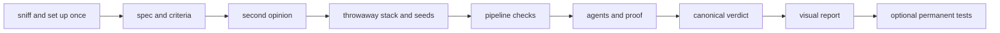

# opslane-verify

A verification layer for Claude Code. Verify turns a spec into reviewed checks, runs them against an isolated local stack, and reports only what the evidence proves.

## How it works


```mermaid
graph LR
    A[sniff and set up once] --> B[spec and criteria]
    B --> C[second opinion]
    C --> D[throwaway stack and seeds]
    D --> E[pipeline checks]
    E --> F[agents and proof]
    F --> G[canonical verdict]
    G --> H[visual report]
    H --> I[optional permanent tests]
```

1. **Set up once** — Verify sniffs boot, seed, health, and local env-file options, then records the confirmed choices in `.verify/setup.json`.
2. **Draft accountable criteria** — each criterion names its system dependencies, proof of execution, and whether it proves new behavior or guards existing behavior.
3. **Get a second opinion** — Codex, or a fresh Claude context, challenges redundant and unreachable checks and identifies missing coverage.
4. **Run in isolation** — Verify boots a throwaway stack, applies repo seeds, and runs the approved front-door seed script with a unique marker.
5. **Check the pipeline** — API, browser, database, worker, sink, and storage checks separate broken infrastructure from product failures. A down part taints only its dependent criteria.
6. **Require proof** — a pass needs its declared marker-bearing artifact or fresh live read. Missing proof becomes `not_proven`.
7. **Render one result set** — the judge cannot omit checks or control the headline. The HTML report derives every count and card from the plan, with playable screenshots and video.
8. **Codify with consent** — after reporting, Verify can add selected checks to the repo's own test suite. It asks before writing each test and never commits.

A typical headline reads: `1 of 3 proven. 1 couldn't run (sink down). Failed: ac3.` The report stays in `.verify/runs/<run_id>/report.html`, and Verify serves it locally.

Verify never holds or asks for sensitive credentials.


## Installation

### Prerequisites

- Claude Code with OAuth login (`claude login`)
- Playwright MCP

### Install

```bash
/plugin marketplace add opslane/verify
/plugin install opslane-verify@opslane/verify
```

**macOS only:** `brew install coreutils` (for `gtimeout`)

## Usage

```bash
# One-time auth setup (skip if your app has no login)
/verify-setup

# Run verification — will ask you for the spec
/verify
```

`/verify` always asks for your spec upfront, then walks you through any clarifying questions before running.

## Debugging failures

```bash
# View Playwright trace for a failed AC
npx playwright show-report .verify/evidence/<ac_id>/trace

# Watch session recording
open .verify/evidence/<ac_id>/session.webm
```
