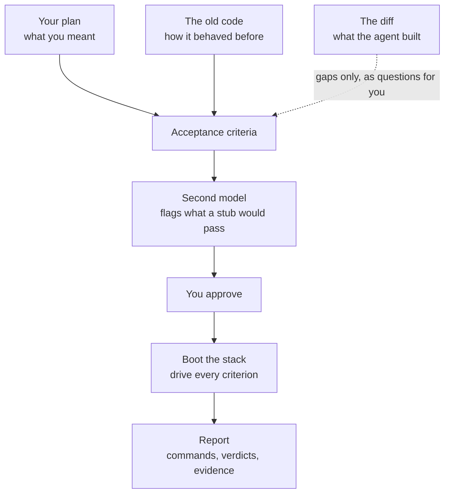

# Verify Skill

Don't trust your agent. Verify it.

Coding agents write more code than anyone can read, and reviewing the diff does not run it. So the agent says done and the tests are green, and both of those came from the agent. Claude checking Claude's own work has one likely answer, and it is that everything works.

That leaves one real check, and it is you. Boot the app, click through it, and find out what the change actually did. Every time.

With Verify, you approve the acceptance criteria first, from what you meant the change to do. Verify boots your stack, drives the change end to end, and hands you a report that shows whether it works, with the evidence behind every line.

It is a Claude Code plugin. You run it locally, after the agent finishes implementing and before you open the PR.

## How it works

- **It reads your plan, not the diff.** The criteria come from what the change was meant to do, so the implementation gets no say in what "correct" means.
- **A second model reviews the criteria.** Codex when installed, otherwise a fresh Claude session that has seen only the plan. It flags the criteria a stub could pass.
- **You approve them.** Nothing runs until you say go. Fix any criterion that does not match what you meant.
- **It boots your whole stack and drives every criterion.** Real HTTP, real rows, real browser. Nothing mocked in process.
- **It hands you the receipts.** Every command it ran, what came back, and the evidence behind each verdict.


```mermaid
flowchart TD
    plan["Your plan<br>what you meant"]
    old["The old code<br>how it behaved before"]
    diff["The diff<br>what the agent built"]
    ac["Acceptance criteria"]
    codex["Second model<br>flags what a stub would pass"]
    you["You approve"]
    run["Boot the stack<br>drive every criterion"]
    rep["Report<br>commands, verdicts, evidence"]

    plan --> ac
    old --> ac
    diff -.->|"gaps only, as questions for you"| ac
    ac --> codex --> you --> run --> rep
```

## Install

```
/plugin marketplace add opslane/verify
/plugin install opslane-verify
```

Needs Node.js on your PATH. This registers `/verify` and `/verify-setup`, plus a Playwright MCP server for browser criteria. In your repository it writes only to `.verify/`, and adds that directory to `.gitignore` if it is not there already.

## Quick start

From your repository, on a branch with a change and a plan:

```
/verify
```

The first time in a repository, it asks you to run `/verify-setup`. Setup looks for a compose file, seed scripts, and env files, asks one question per thing it could not decide, and writes `.verify/setup.json`. It never asks for or stores a secret. Commit that file and your teammates skip the interview.

After that, `/verify` writes the criteria, has them reviewed, and stops. Read them. If one is wrong, say so. When they look right, say:

```
go
```

It boots the stack, seeds it, drives each criterion, tears the stack down, and prints the report. Everything it produced is in `.verify/runs/<timestamp>/`.

## We test the intent, not the code

Every expectation comes from the plan, or from how the code behaved before the change. Never from the diff.

A check written from the implementation confirms the implementation against itself, so it cannot fail. This is also why the agent's own tests pass. The test and the code came from the same understanding, so they agree even when both are wrong.

Verify reads the diff once, to find what the plan does not explain. Each of those becomes a question for you rather than an answer it invents. If it cannot find a plan at all, it asks for one and stops.

Two guards sit on top of that. Each criterion records whether the old code would have passed it, so one meant to prove new behaviour that the old code already passes gets flagged before you approve. And the second model reads the whole set looking for criteria a lazy implementation would satisfy. On a real run it caught one that any code labelling every job as access-denied would have passed, and another whose check compared the worker's output against the worker's own count.

## We run your whole stack for every change

Verify does not test your code in isolation. Every run boots the whole thing.

With a compose file, each run gets its own compose project, so it never collides with your dev stack or with another run. Boot is `up -d --wait`. Teardown is `down -v`, so the volumes go too and nothing leaks into the next run. Without compose, a start command and a health URL work the same way.

Then it seeds. Your repository's own seed scripts run first. After them, a per-run script creates whatever the criteria need through the app's front door, with a marker unique to the run woven into every record. You read that script before anything runs.

Then it probes every part the criteria depend on: a marker round trip for the database, a request for the API, your one-line liveness command for a worker, a queue, or storage. A part that is down turns its criteria into "could not run" rather than a failure blamed on your change.

Nothing is mocked in process. The bugs that survive unit tests live in the parts that usually get mocked: the webhook that fires twice, the migration that runs against real rows, the page that renders before its data resolves.

## We give you the receipts

A verdict you cannot check is just another agent saying "done". So every criterion carries the commands that ran and what came back. It also carries an artifact proving the check happened in this run: a row bearing the run's marker, a screenshot taken at the moment of observation, or a value read live. A status code on its own is not evidence, and a criterion with no way to prove it ran is not run.


The report also separates four questions that one word would blur.

- **Proven** is how many verdicts the evidence supports. A pass with no receipt behind it does not count.
- **Behaviour** is what your code did. This is the pass or fail line.
- **Ran** is whether the check itself could run. A dead database container shows up here, not as a failing test.
- **Covered** is whether every changed file has at least one criterion touching it.

Every report ends with a section called "Not checked", printed even when it is empty. It lists what did not run and why, along with anything the run noticed on its way past. In the run above, that section is where Verify reported that the plan and the code disagreed about how one failure should be classed. Nothing had asked it to compare the two.

## Going deeper

- [A run, walked through](docs/example-run.md): five criteria on a real change, what the second model flagged, what failed, and what the report found on its own.
- [What it can test](docs/what-it-can-test.md): APIs, databases, CLIs, queues and webhooks, and web UIs in a real browser, and what each one needs from you.
- [How it runs your stack](docs/how-it-runs-your-stack.md): the setup contract, boot modes, seeding, probes, teardown, login capture, and what makes a repository easy to verify.
- [`examples/agent-fail-v2/`](examples/agent-fail-v2/): the raw criteria, report, and HTML report from that run.

## License

MIT
