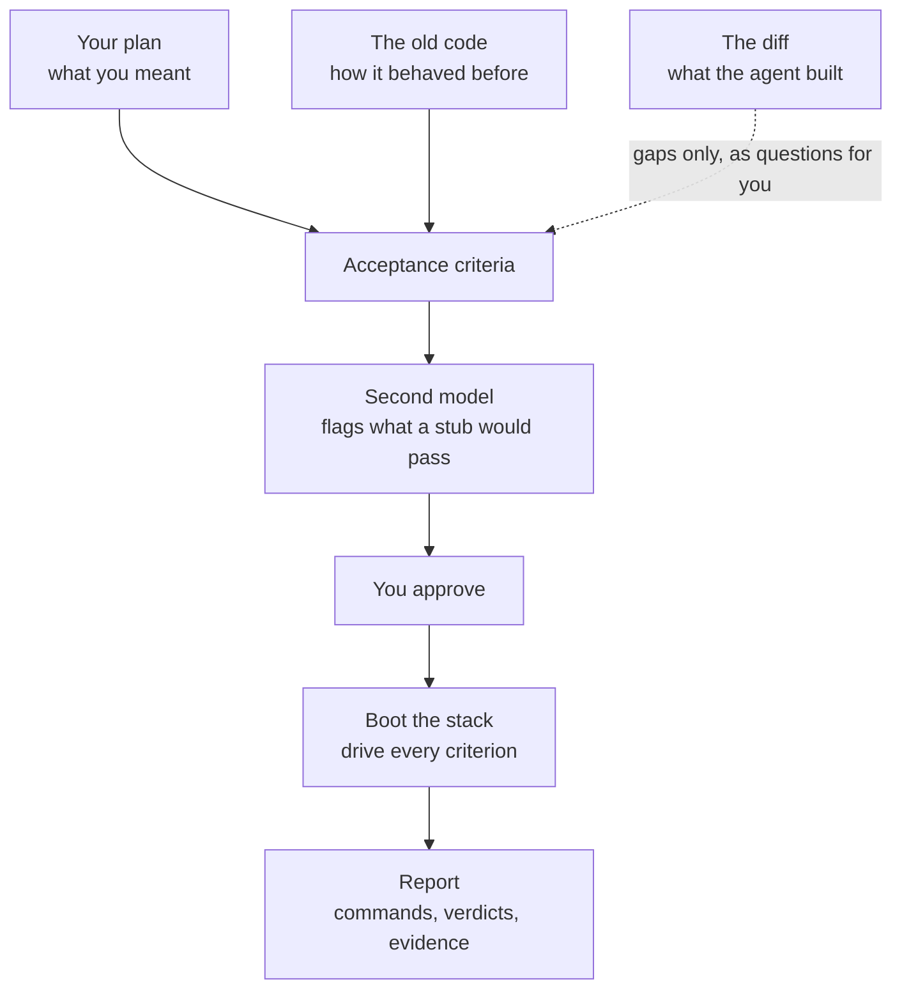
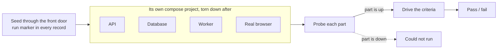
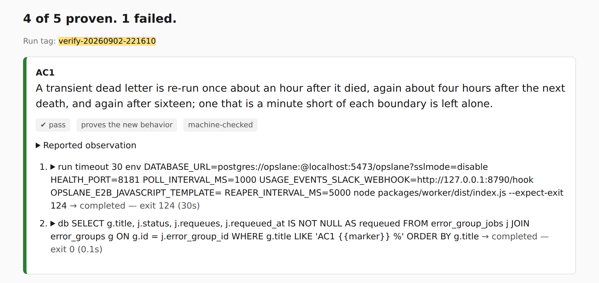

# Don't trust your agent. Verify it.

<!--
Windows, in alt-tab order:
  1  this file, rendered (the diagrams live here)
  2  examples/agent-fail-v2/criteria.md, rendered, zoomed so one claim fills the screen
  3  examples/agent-fail-v2/report.html, opened as a local file
Budget: about 3:50 spoken. The comments hold the words; the room sees only the
headings, the diagrams, and the screenshot.
-->

**Abhishek Ray, founder of Opslane**

<!-- 0:00
"Hey everybody, my name is Abhishek. I'm the founder of Opslane. We're building
an open-source agent that finds user-facing issues, investigates them, and
opens PRs for them. I'm not going to talk about Opslane today. I'll talk about
a skill I built to check my own work while building it."
-->

## Verification is the bottleneck now

Write a spec with Claude. Have Codex implement it. The unit tests pass, because Claude does not write unit tests that fail. Then sit down and click through every edge case by hand.

The agent says done and the tests are green, and both of those came from the agent.

<!-- 0:20
"I'm guessing this is true for most of us. As the coding agents got better, the
bottleneck moved from writing code to trusting it. Here's my loop. Spec with
Claude, Codex implements, unit tests pass, and they always pass, because Claude
does not write unit tests that fail. Then I click through everything by hand
and find that half of it isn't what I asked for. The agent says done and the
tests are green, and both of those came from the agent."
-->

## Where the checks come from

<!-- 0:50 · THE CORE IDEA. Slow down here.
"So I built a Claude Code skill called verify. This is the whole thing in one
picture."
Point at the two solid arrows on the left.
"The acceptance criteria come from my plan, and from how the code behaved
before the change."
Point at the dotted arrow.
"This is the only arrow coming from the diff. It's dotted, and it only carries
questions. If something in the change isn't explained by my plan, it asks me
about it. It never answers on its own."
"That's the whole trick. My first version wrote the criteria by reading the
diff, and they passed every single time. Of course they did. The code had
already told them what to expect. That's also why your agent's own tests pass:
the test and the code came from the same understanding, so they agree even
when they're both wrong."
Point at the second model and the approval box.
"Then a second model that hasn't seen my criteria attacks them, looking for
ones a lazy implementation would pass. And nothing runs until I say go."
-->

## The criteria it wrote

<!-- 1:40
"Here's a run from last night. Quick context so the criteria make sense.
Opslane runs an AI investigation on every incident a customer reports.
Sometimes that investigation dies halfway: the model runs out of turns, or the
provider is down. Before this change, the customer saw 'needs a human' on their
dashboard for what was really our failure. The change makes it retry quietly
instead."

SWITCH → criteria.md, zoomed so one Plain claim fills the screen.
"It wrote five criteria. I wrote none of them. Here's one."
Read AC3: "When the model runs out of room on a real investigation of a real
repository, the job is not retried, the incident is not shown to the customer,
and the failure is labelled as ours."
Translate: "In plain terms: when our AI gives up halfway, don't retry forever,
don't show the customer a half-finished answer, and mark it as our bug, not
theirs. No file names in there. Everything in it can be watched from outside
the code."
"It also told me it wasn't sure about one of the five. I ran it anyway."

SWITCH → back to this file.
-->

## It boots your whole stack

<!-- 2:25
"Second thing. It doesn't test the code in isolation. Every run boots the whole
stack in its own compose project, so it never collides with my dev environment
or another run, and it tears it down afterwards, volumes and all."
"It seeds through the app's front door, and it weaves a marker unique to the
run into every record it creates, so a check that never actually ran can't
quietly pass."
Point at the dotted branch.
"Then it probes every part before judging anything. If the database is down,
those criteria come back as 'could not run'. They don't come back as my change
being broken. That distinction is the difference between a report I trust and
a flaky test suite I learn to ignore."
"Last night that meant a real Postgres, a real cloud sandbox, and a real model
running against a real repository. For the outage case it stood up a fake
provider that answers 529 to every call. I used to mock those parts, and the
failures just moved to staging."
-->

## It gives you the receipts

<!-- 3:05
"Third. A verdict you can't check is just another agent saying done. So every
criterion carries the commands that ran and what came back."
Point at the headline, then the badges, then the two commands.
"Four of five proven, one failed. Every claim in plain language, and underneath
it the actual commands, with exit codes."

SWITCH → report.html.
"And the one that failed is my favourite part."
Expand it. Read only the first sentence, flat:
"The expectation was built on a wrong premise, mine."
Paraphrase the rest: "It had assumed a feature worked one way. It works another
way. So instead of failing my code, it told me my criterion was wrong, and
showed me the log line that proves it."

Scroll to Not checked.
"And every report ends with what it did not check. This one noticed, without
being asked, that my plan and my code disagreed about how one failure gets
classified. This is the section I read first now."
-->

## What I'd want you to take from this

Write the acceptance criteria first, from what you meant. Don't let the judge read the code.

`github.com/opslane/verify`

<!-- 3:40
"If you take one thing away: write the acceptance criteria first, from what you
meant, and don't let the judge read the code. It's open source, and the run I
just showed you is checked into the repo. Thanks."
-->
