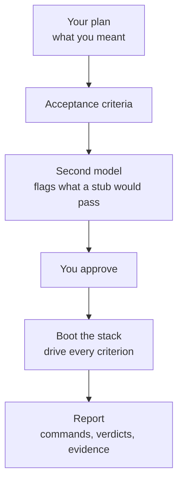
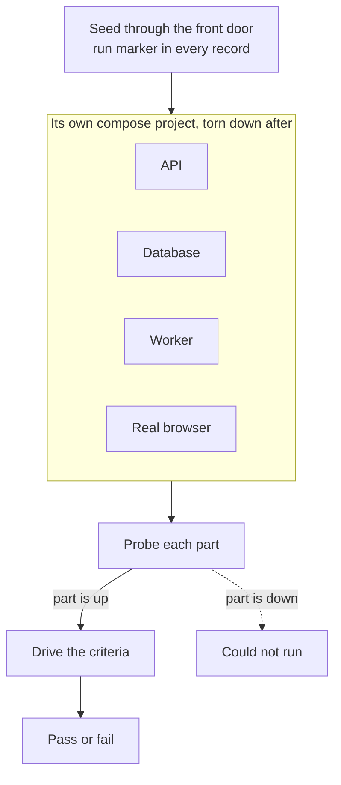

# Don't trust your agent. Verify it.

<!--
Windows, in alt-tab order:
  1  this file, rendered (the diagrams live here)
  2  examples/agent-fail-v2/criteria.md, rendered, zoomed so one claim fills the screen
  3  examples/agent-fail-v2/report.html, opened as a local file
Budget: about 3:30 spoken. The comments hold the words; the room sees only the
headings, the diagrams, and the screenshot.
-->

**Abhishek Ray, founder of Opslane**

<!-- 0:00
"Hi everybody, my name is Abhishek. I'm the founder of Opslane. Today I'm going
to talk about a skill I've been building called Verify. The thesis is simple:
don't trust what your agent did, verify it."

Do NOT add "I won't go into the details, the repo has everything." It tells the
room the interesting part is elsewhere, and then you go into details anyway.
The repo link belongs at the end.
-->

## Verification is the bottleneck now

Claude writes the spec. Codex implements it. The unit tests pass, because Claude does not write unit tests that fail. Then I am the manual QA.

The agent says done and the tests are green, and both of those came from the agent.

<!-- 0:20
"I think for all of us, as the coding agents have gotten better over the last
six months, writing code is no longer the bottleneck. It moved from writing
code to trusting it. My loop used to be: Claude writes the spec, Codex
implements it, and then I'm the manual QA. The unit tests pass, and they always
pass, because Claude does not write unit tests that fail. So the agent says
done and the tests are green, and both of those came from the agent."
-->

## How verify works?



<!-- 0:50 · about 35 seconds. Keep it short; the JSON beat does the explaining.
"So I built a Claude Code skill called Verify. Four or five steps."
Point along the chain as you say them.
"You start with the plan you already wrote. From the plan it derives acceptance
criteria, which are really just user requirements: what has to be true for this
change to have worked."
Point at the space around the diagram.
"Notice what isn't in this picture. Your code. If you derive the criteria from
the diff they always pass, because the test and the code came from the same
understanding."
"Then a second model, Codex, reviews the criteria before they come to me. I
approve them. Then it boots the whole stack, drives each one, and reports."

Do NOT also say here that the criteria trace back to your plan file. You say it
again over the JSON, pointing at the actual field. Saying it twice is where
about thirty seconds went in the five-minute run.
-->

## What is an acceptance criterion?

A user requirement. It states the intent behind the change, written down before anyone looks at the implementation, so there is something to compare the implementation against.

Here is one from a change where I put billing behind a feature flag:

> With billing off, the billing API routes return 404, as if they were never added.

Underneath, it is a row of `criteria.json`:

```json
{
  "id": "AC1",
  "plain": "With billing off, the billing API routes return 404 as if they were never added.",
  "source":    { "kind": "plan", "ref": "design: 'Unset: no billing routes (404)'" },
  "intent":    "preserves",
  "dependsOn": ["api"],
  "proof":     { "kind": "marked-request-rejected", "detail": "404 paired with the marker-bearing request URL" },
  "drive": [
    { "verb": "http", "args": ["GET", "/api/v1/billing/summary?m={{marker}}"] }
  ]
}
```

Four verbs exist: `run`, `db`, `http`, `wait`. No shell strings, no assertions, no verbs specific to my app. The model writes this plan. A plain engine runs it verbatim, with no model in the loop.

<!-- 1:35 · about 50 seconds. The technical beat.
"So what is an acceptance criterion? It's a user requirement. It says what the
change was meant to do, written down before anyone looks at the code, so you
have something to compare the implementation against."

"Here's one. I was putting billing behind a feature flag." Read the claim.
"With billing off, the billing routes should 404, as if we never added them.
That's a requirement anyone can check. You don't need to know my codebase."

"But a criterion isn't just a sentence. Underneath it's this."
Point at source. "Where it came from. It traces back to a line in my design
doc, so I can check it against what I actually asked for."
Point at dependsOn. "What has to be running. This one needs the API. If the API
is down, it comes back as could-not-run rather than as my change being broken."
Point at proof. "How you know the check really happened. There's a marker
unique to this run in the query string, so the 404 is paired with a request I
can point at."
Point at drive. "And the plan itself. One HTTP call. There are four verbs in
total: run, db, http, wait. No shell strings, no assertions, nothing specific
to my app."

"That's what makes runs reproducible. The model writes this plan, and a plain
engine executes it verbatim with no model in the loop. A plan that needs
changing goes back through approval; it never gets patched mid-run."

NOTE: this example is from the billing change. The report you show later is
from a different run. Say "here's one from another change" if you want, or just
don't imply they're the same run.
-->

## It boots your whole stack



<!-- 2:25 · about 30 seconds.
"Second thing that mattered. These are end-to-end tests, not unit tests, so
every run boots the whole stack with docker compose, in its own project, and
tears it down afterwards. I had to re-architect a bit to make that possible."
"It seeds through the app's front door, with a marker unique to the run in
every record it creates."
Point at the dotted branch.
"Then it probes each part before judging anything. A part that's down turns its
criteria into could-not-run, rather than my change looking broken."
"For this change that meant a real Postgres in Docker, a real cloud sandbox,
and a real model run against a real repository. Opslane integrates with Slack
and GitHub, so I keep small twins of those to drive end to end."

Say "a real cloud sandbox" and "a real model run", not "my Claude sandbox
provider" or "anthropic tests".
-->

## It gives you the receipts


<!-- 3:05 · about 40 seconds.
"Last part, and the one that matters most. If you don't get evidence, you can't
tell whether the agent really ran anything. So the report carries every command
it ran and what came back."
Point at the headline, the badges, then the commands.
"Four of five proven, one failed. Each claim in plain language, the actual
commands underneath, with exit codes."

SWITCH → report.html.
"One of the five failed. When I looked, the criterion was wrong, not the code.
It had assumed the feature worked one way and it works another, and it pointed
at the log line that showed the actual behaviour."

Scroll to Not checked.
"And every report ends with what it did not check, including anything the
reviewer asked for that never got driven."

ACCURACY: the second model reviews the criteria before you approve them. It
never sees the report. Do not say the report goes back to a second model that
confirms the tests succeeded.
-->

## Three things that helped

1. Write the criteria from your spec, not the implementation.
2. Test the whole stack.
3. Get the agent to give you evidence.

`github.com/opslane/verify`

<!-- 3:20
"Three things that were useful for me, if you're building something like this."
"One: write your criteria from your spec, not the implementation."
"Two: make it easy to spin up your whole stack, so the agent can test end to
end."
"Three: get evidence back, so you can check what it actually ran."
"It's open source, and the run I showed you is in the repo. Thanks."
-->
