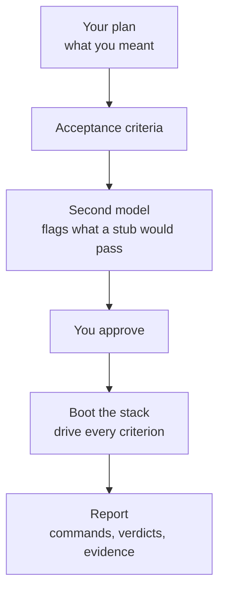
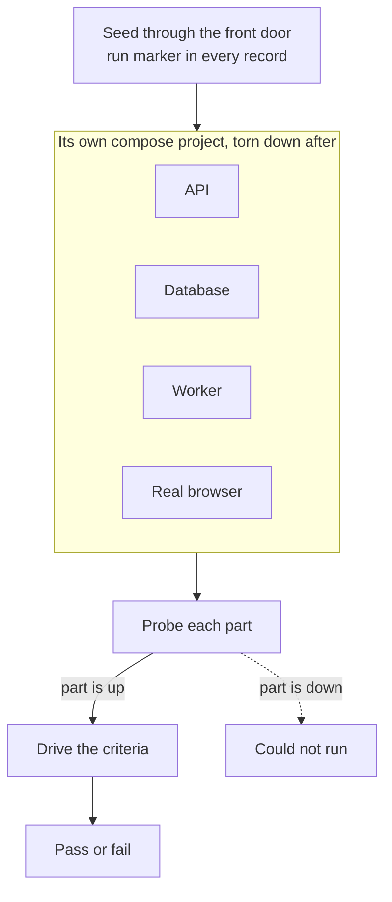

# Don't trust your agent. Verify it.

<!--
Windows, in alt-tab order:
  1  this file, rendered (the diagrams live here)
  2  examples/agent-fail-v2/criteria.md, rendered, zoomed so one claim fills the screen
  3  examples/agent-fail-v2/report.html, opened as a local file
Budget: about 3:30 spoken. The comments hold the words; the room sees only the
headings, the diagrams, and the screenshot.
-->

**Abhishek Ray, founder of Opslane**

<!-- 0:00
"Hi everybody, my name is Abhishek. I'm the founder of Opslane. Today I'm going
to talk about a skill I've been building called Verify. The thesis is simple:
don't trust what your agent did, verify it."

Do NOT add "I won't go into the details, the repo has everything." It tells the
room the interesting part is elsewhere, and then you go into details anyway.
The repo link belongs at the end.
-->

## Verification is the bottleneck now

Claude writes the spec. Codex implements it. The unit tests pass, because Claude does not write unit tests that fail. Then I am the manual QA.

The agent says done and the tests are green, and both of those came from the agent.

<!-- 0:20
"I think for all of us, as the coding agents have gotten better over the last
six months, writing code is no longer the bottleneck. It moved from writing
code to trusting it. My loop used to be: Claude writes the spec, Codex
implements it, and then I'm the manual QA. The unit tests pass, and they always
pass, because Claude does not write unit tests that fail. So the agent says
done and the tests are green, and both of those came from the agent."
-->

## How verify works?



<!-- 0:50 · about 35 seconds. Keep it short; the JSON beat does the explaining.
"So I built a Claude Code skill called Verify. Four or five steps."
Point along the chain as you say them.
"You start with the plan you already wrote. From the plan it derives acceptance
criteria, which are really just user requirements: what has to be true for this
change to have worked."
Point at the space around the diagram.
"Notice what isn't in this picture. Your code. If you derive the criteria from
the diff they always pass, because the test and the code came from the same
understanding."
"Then a second model, Codex, reviews the criteria before they come to me. I
approve them. Then it boots the whole stack, drives each one, and reports."

Do NOT also say here that the criteria trace back to your plan file. You say it
again over the JSON, pointing at the actual field. Saying it twice is where
about thirty seconds went in the five-minute run.
-->

## What an acceptance criterion looks like

Opslane runs an AI investigation on every incident a customer reports. Sometimes that investigation dies halfway: the model runs out of turns, or the provider is down. The customer used to see "needs a human" for what was really our failure. That was the change.

It wrote five criteria from that plan. I wrote none of them. In plain language, one of them says:

> A transient dead letter is re-run once about an hour after it died, again about four hours after the next death, and again after sixteen; one that is a minute short of each boundary is left alone.

Underneath, it is a row of [`criteria.json`](../../examples/agent-fail-v2/criteria.json):

```json
{
  "id": "AC1",
  "plain": "A transient dead letter is re-run once about an hour after it died ...",
  "source":    { "kind": "plan", "ref": "Task 4: interval requeue 1h x 4^requeues" },
  "intent":    "changes",
  "dependsOn": ["db"],
  "proof":     { "kind": "marker-in-data", "step": 2 },
  "drive": [
    { "verb": "run", "args": ["timeout","30","env","REAPER_INTERVAL_MS=5000","node","packages/worker/dist/index.js","--expect-exit","124"] },
    { "verb": "db",  "args": ["SELECT g.title, j.status, j.requeues FROM error_group_jobs j JOIN error_groups g ON g.id = j.error_group_id WHERE g.title LIKE 'AC1 {{marker}} %'"] }
  ]
}
```

Four verbs exist: `run`, `db`, `http`, `wait`. No shell strings, no assertions, no verbs specific to my app. The model writes this plan. A plain engine runs it verbatim, with no model in the loop.

<!-- 1:35 · THE TECHNICAL BEAT. This is what the room hasn't seen elsewhere.
Show it live in the terminal if you prefer; the page carries the same thing as
a backup.

"Here's a change from yesterday. My agent on Opslane runs an investigation on
every incident a customer reports, and sometimes it dies halfway. The model
runs out of turns, the provider is down. The customer used to see 'needs a
human' for what was really our failure."

"It wrote five criteria from that plan. I wrote none of them. In plain
language, here's one." Read the quote.

"But a criterion isn't a sentence. Underneath it's this."
Point at source. "Where it came from. This traces back to a line in my plan, so
I can check it against what I actually asked for."
Point at dependsOn. "What has to be up. If the database is down, this comes
back as could-not-run, not as my change being broken."
Point at proof. "How you know the check happened. Step two's output has to
contain a marker unique to this run. If that string isn't there, it doesn't
pass, whatever the model thinks."
Point at drive. "And the plan. Exactly four verbs: run, db, http, wait. No
shell strings, no assertions, nothing specific to my app."

"That's the split that makes runs reproducible. The model writes the plan. A
dumb engine executes it verbatim, and there's no model in the loop while it
runs. A plan that needs changing goes back through approval. It never gets
patched halfway through a run."
-->

## It boots your whole stack



<!-- 2:25 · about 30 seconds.
"Second thing that mattered. These are end-to-end tests, not unit tests, so
every run boots the whole stack with docker compose, in its own project, and
tears it down afterwards. I had to re-architect a bit to make that possible."
"It seeds through the app's front door, with a marker unique to the run in
every record it creates."
Point at the dotted branch.
"Then it probes each part before judging anything. A part that's down turns its
criteria into could-not-run, rather than my change looking broken."
"For this change that meant a real Postgres in Docker, a real cloud sandbox,
and a real model run against a real repository. Opslane integrates with Slack
and GitHub, so I keep small twins of those to drive end to end."

Say "a real cloud sandbox" and "a real model run", not "my Claude sandbox
provider" or "anthropic tests".
-->

## It gives you the receipts


<!-- 3:05 · about 40 seconds.
"Last part, and the one that matters most. If you don't get evidence, you can't
tell whether the agent really ran anything. So the report carries every command
it ran and what came back."
Point at the headline, the badges, then the commands.
"Four of five proven, one failed. Each claim in plain language, the actual
commands underneath, with exit codes."

SWITCH → report.html.
"One of the five failed. When I looked, the criterion was wrong, not the code.
It had assumed the feature worked one way and it works another, and it pointed
at the log line that showed the actual behaviour."

Scroll to Not checked.
"And every report ends with what it did not check, including anything the
reviewer asked for that never got driven."

ACCURACY: the second model reviews the criteria before you approve them. It
never sees the report. Do not say the report goes back to a second model that
confirms the tests succeeded.
-->

## Three things to steal

1. **Write the criteria from your spec, not the implementation.** Code that wrote its own test agrees with itself.
2. **Separate the part that thinks from the part that runs.** A model writes the plan. A deterministic engine executes it and keeps the receipts. Nothing gets patched mid-run.
3. **Make a pass provable.** A marker unique to the run, woven into every record, so a check that never ran cannot quietly pass.

`github.com/opslane/verify`

<!-- 3:40
"Three things you can steal even if you never install this."
"One: write the criteria from your spec, not from the implementation. Code that
wrote its own test will always agree with itself."
"Two: separate the part that thinks from the part that runs. Let a model write
the plan, then let a boring engine execute it and keep the receipts."
"Three: make a pass provable. A marker unique to the run in every record, so a
check that never actually ran can't quietly pass."
"It's open source, and the run I just showed you is in the repo. Thanks."
-->
